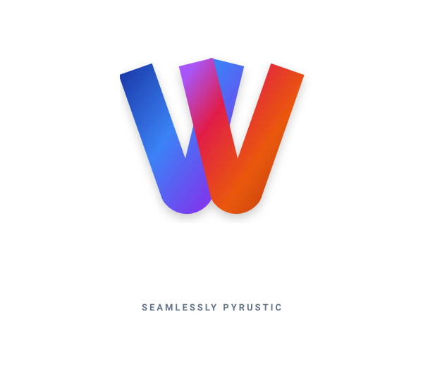

<div align="center">
  
</div>

# Architecture

Weft is an ASGI and WSGI server in one Rust extension module (`weft._weft`)
plus a thin Python layer. The design follows one rule: **the server and the
application run on the same thread, in the same event loop, and talk through
the CPython C API directly.** Nothing crosses a thread boundary on the
request path, and no Python-level glue runs between the socket and the
application.

The protocols and numbers are in [README.md](README.md) and
[BENCHMARKS.md](BENCHMARKS.md).

## Layout

```
src/
  lib.rs         Worker type and module init
  core.rs        Tokio LocalRuntime, select driver, accept, shutdown
  http.rs        HTTP/1.1 framing, the per-request pump
  asgi.rs        Scope, send / receive, dispatch
  wsgi.rs        Environ, start_response, iterable, --wsgi-threads
  types.rs       Native Python types: ASGISend, ASGIReceive, TaskDone, Ready
  ws.rs          WebSocket
  h2c.rs         HTTP/2
  h3c.rs, wt.rs  HTTP/3 and WebTransport
  tls.rs         rustls, SNI
  staticf.rs, compress.rs, cache.rs
  ops.rs, metrics.rs, limit.rs
  fdpoll.rs      asyncio fds on the Tokio driver
  winaccept.rs   Windows shared-listener accept thread
  py.rs, interned.rs
weft/
  loop.py        WeftSelector, WeftEventLoop
  worker.py      lifespan, serve, signals, drain
  server.py      bind; inline, process and thread workers
  contrib/       WebTransport routers, AltSvc, resumable uploads
```

---

## The event loop

`WeftEventLoop` is an ordinary `asyncio.SelectorEventLoop`. Its selector,
`WeftSelector`, forwards to the native `Worker`:

* `register` / `modify` / `unregister` add asyncio's descriptors to the
  Tokio I/O driver (on Unix through `AsyncFd`; on Windows through a
  duplicated socket handle registered with Tokio's IOCP driver).
* `select(timeout)` calls `Core::select`, which runs the Tokio runtime with
  `block_on` until one of:
  * a server task handed asyncio work to do (created a request task,
    resolved a future), signalled by `py_scheduled`;
  * an asyncio descriptor is ready (a Tokio readiness hint confirmed by a
    zero-timeout `poll`/`WSAPoll`, so that stale readiness never reaches
    asyncio);
  * another thread called `call_soon_threadsafe`: `_write_to_self` is
    replaced by `Worker.wakeup()`, a Tokio `Notify`, instead of a self-pipe
    byte;
  * the timeout asyncio asked for elapsed.

  A zero timeout (asyncio has ready callbacks) runs one tick: it polls a
  pinned `yield_now()` future, so runnable server tasks run and the I/O
  driver is polled without blocking.

All server work (accepting, parsing, writing) happens inside `select`, as
Tokio tasks on the asyncio thread. Tasks call into Python directly, so the
GIL is held while they run. It is released in Tokio's `on_thread_park` hook,
only while the runtime waits in the OS, and only if no Python work is
pending. Other Python threads, such as the thread pool behind sync FastAPI
endpoints, run whenever the server is idle.

Wakeups that originate in Python calls (`send` flushing, `receive` waiting)
are deferred: the waker goes into a list that `select` runs inside the
runtime's context, where waking a task is a push onto the local run queue
instead of a syscall to unpark the driver.

---

## A request

1. The connection task reads into its buffer and parses the head with
   `httparse`. It validates framing (content-length, transfer-encoding and
   their conflicts, `Connection`, `Expect`) before any Python runs.
2. `asgi::start` builds the scope:
   * `PyDict_Copy` of a prototype holding every constant entry (`type`,
     `asgi`, `scheme`, `root_path`, `server`);
   * interned keys and interned method strings;
   * header names lowercased once per distinct raw name and cached as
     `bytes` (bounded cache);
   * the client tuple, cached per connection;
   * a shallow copy of the lifespan state.
3. It creates the `receive` and `send` objects. They are native vectorcall
   objects that carry a token: connection slot, generation and request
   sequence number. Calls from a stale request or a closed connection
   resolve to nothing instead of touching a reused slot.
4. It calls `app(scope, receive, send)`, wraps the coroutine in
   `asyncio.Task(coro, loop=loop)` (a vectorcall with kwnames), attaches the
   native `TaskDone` callback, and signals asyncio. The task runs in the same
   `_run_once` iteration.

HTTP/2 and HTTP/3 rebuild the head as HTTP/1.1 text and re-parse it, so the
scope builder, the WSGI environ and the access log stay on one
representation.

### `send`

`http.response.start` validates and encodes the status line and headers into
a buffer, noting content-length, transfer-encoding, `Connection`, `Date` and
`Server`. Nothing is written yet.

The first `http.response.body` decides the framing:

* a declared content-length is used as is;
* a single complete body gets a computed content-length;
* a streamed body gets chunked encoding (HTTP/1.1), or close-delimited
  framing (HTTP/1.0).

HEAD, 1xx, 204 and 304 responses carry no body. The head and the first body
go out in one buffer, written to the socket with `try_write` **inside the
call**, before `send` returns. If everything was written, or the backlog is
under the high-water mark (512 KB), `send` returns a shared, pre-completed
awaitable. Otherwise it returns an `asyncio.Future`, resolved by the
connection task when the backlog drains below 64 KB. That is backpressure
for slow clients.

The pre-completed awaitable (`Ready`) implements `am_await`, `am_send` and
`tp_iternext`. It finishes immediately, returning `None`. On 3.12+ the
`SEND` opcode goes through `tp_iternext` for non-generator awaitables, so
returning a value means raising `StopIteration(value)`, which `Ready` does.

### `receive`

If body bytes have already been read, `receive` returns a `Ready` that
yields the `http.request` message. The await does not suspend. A request
with no body returns `{'type': 'http.request', 'body': b'', 'more_body':
False}` the same way. Otherwise `receive` parks an `asyncio.Future` on the
connection. The connection task resolves it when data arrives, or with
`http.disconnect` when the client goes away or the response completes.
`Expect: 100-continue` is answered on the first `receive`.

Request bodies are read ahead up to 256 KB. Beyond that, reading stops until
the application consumes the body. While the application works, the
connection keeps reading up to 64 KB past the request, to notice a client
that disconnects, and to buffer pipelined requests.

### Completion

The `TaskDone` callback retrieves the task's exception, if any, and reports
it through the `weft` logger. If no response was started, it sends a 500; a
half-sent response closes the connection. The connection then either reads
the next request (keep-alive, pipelining), discards up to 256 KB of request
body the application left unread and continues, or closes.

---

## WSGI

A two-argument callable is treated as WSGI; `--protocol` overrides the
guess. The body is read in full, then the application is called inline on
the worker thread. `start_response` is a native object that is also
`write()`. The response iterable is sent block by block; between blocks the
connection task flushes and parks on the socket, so a slow client stalls
only its own generator.

`--wsgi-threads N` moves the application call onto N threads per worker.
The connection task still owns every socket. Inline is the default because
it is the fastest path for a handler that returns immediately.

`wsgi.input` is currently `io.BytesIO` of the body. The HTTP connection
task is still the ASGI one: Tokio driven from `asyncio.select()`. That is
why raw WSGI on Weft is close to raw ASGI, and why Peregrine's asyncio-free
WSGI poller pulls ahead on that column in [BENCHMARKS.md](BENCHMARKS.md).

---

## HTTP/2, HTTP/3, WebTransport

HTTP/2 is the default over TLS (ALPN `h2`). Cleartext prior knowledge is
also served. Streams are slots in the same connection table with `fd = -1`
and a pointer back to the parent.

HTTP/3 is QUIC (`--http3`, `--quic-port`). The UDP socket belongs to the
QUIC listener; the connection slot exists so a QUIC connection is a
connection like any other. `alt-svc` is added to HTTP/1.1 and HTTP/2
responses when HTTP/3 is on.

WebTransport is the extended CONNECT (`:protocol: webtransport`) as ASGI
`type=webtransport`. Streams and datagrams are demultiplexed in `wt.rs`.
`weft.webtransport.WebTransportSession` and `weft.contrib` sit on top of
that message protocol. Stream and datagram *sends* after an incoming
session are not yet reliable (the QUIC connection is locally closed on
that path); receive and the CONNECT handshake are.

TLS is rustls. `--tls-cert` / `--tls-key` may be repeated for SNI.
`--hsts` and `--redirect-http` are server-side. ACME is left to the
reverse proxy.

---

## Connections

Each connection is an `Rc<Conn>` in a slab, with its state in a `RefCell`.
A borrow is never held across a call into Python, because Python code can
re-enter `send` or `receive`. The connection task alternates between reading
the next head (bounded by the keep-alive timeout when idle, the header
timeout otherwise) and pumping a request.

On close, it flushes any response the server wrote itself (for up to 1 s),
resolves outstanding waiters, shuts down the write side, and lingers briefly
reading until the client closes. The linger avoids a reset that would
destroy the response when unread input is pending.

Limits and errors the server answers itself:

* 400 for malformed heads and framing conflicts;
* 431 for a head larger than `--max-head` (64 KB by default);
* 500 when the application fails before responding;
* 503 when `--max-connections` is reached.

---

## Workers

A worker is one `Worker` with one `WeftEventLoop`, on one thread.
`weft/server.py` binds the listening socket once, then runs:

* **inline**, the default single worker;
* **processes** (`--workers N`), spawned with the socket passed to each
  child. Crashed workers restart. A worker whose lifespan startup fails ends
  the server (exit code 3);
* **threads** (`--workers N --worker-mode thread`), each with its own loop.
  They run in parallel only on free-threaded Python. The module declares
  `Py_mod_gil = Py_MOD_GIL_NOT_USED`, so importing it does not re-enable
  the GIL.

All workers accept from the same socket. On Unix each worker accepts
through Tokio directly. On Windows a worker that shares the listener accepts
on a small dedicated thread (`src/winaccept.rs`) and hands connections to
its runtime. The dedicated thread is there for two reasons:

* When several processes wait on one listener, a non-blocking `accept()`
  can block inside Winsock if another process takes the connection first.
  On the worker thread, that would hold the GIL until the next connection.
  The accept thread instead uses `AcceptEx`, which the kernel completes
  with a connection of its own and which can be cancelled.
* Pending `AcceptEx` requests are served most recent first, so a worker
  that kept one posted would take every connection. The thread posts only
  once `WSAPoll` reports a queued connection, and cancels if another worker
  got it within a few milliseconds.

The accept thread costs one handoff per connection and none per request. A
single worker on a listener it owns accepts through Tokio on every platform.

`--reload` and `SIGHUP` replace process workers one at a time without
dropping the listener.

Shutdown (SIGINT/SIGTERM, Ctrl+C on Windows, or the supervisor's stop event)
follows this order:

1. stop accepting and close idle connections;
2. let in-flight requests finish, answering them with `connection: close`,
   until `--graceful-timeout`;
3. cancel what is left;
4. run lifespan shutdown.

---

## What is deliberately absent

* **No runtime thread.** The request path never crosses threads, so it has
  no queues, no GIL handoff and no `call_soon_threadsafe`. The only extra
  thread is the Windows accept thread described above, which touches
  connections once, before any request is read. `--wsgi-threads` is an
  opt-in pool around the application call only.
* **No Python-level protocol code.** asyncio's transports and protocols are
  not used for the server's sockets.
* **No ACME.** Certificate issuance is left to Caddy (or another proxy).
